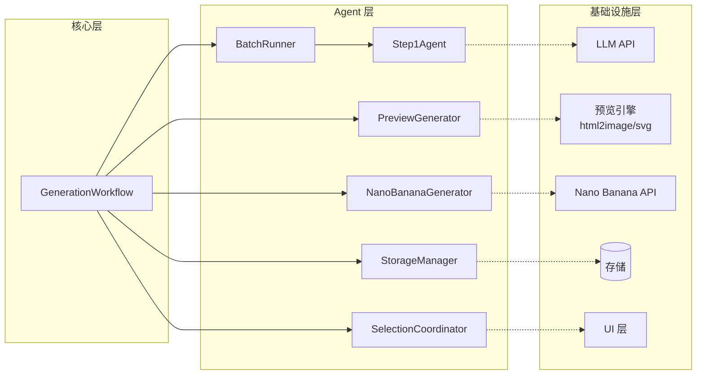

# Architecture: Batch Generation & Preview System

## 系统目标

1. **批量处理**: 高效并行处理多篇论文的 STEP1 (MODULE LIST 生成)
2. **低成本预览**: 通过模拟预览避免昂贵的 Nano Banana 无效调用
3. **精准选择**: 支持用户基于预览选择最佳方案后再生成最终图像
4. **容错处理**: 单点失败不影响整体流程

---

## Agent Team 架构图

```mermaid
graph TB
    subgraph Input["输入层"]
        P[Paper List<br/>List[Paper]]
    end
    
    subgraph Batch["批处理层"]
        BR[BatchRunner<br/>集成负责人]
        BR -->|dispatch| S1A[Step1Agent-1]
        BR -->|dispatch| S1B[Step1Agent-2]
        BR -->|dispatch| S1C[Step1Agent-3]
        BR -->|dispatch| S1D[Step1Agent-N]
    end
    
    subgraph Preview["预览层"]
        PG[PreviewGenerator<br/>预览生成Agent]
        SC[SelectionCoordinator<br/>选择协调Agent]
        PG -->|previews| SC
    end
    
    subgraph Output["输出层"]
        NG[NanoBananaGenerator<br/>最终生成Agent]
    end
    
    subgraph Storage["存储层"]
        DB[(结果存储<br/>JSON/Bitable)]
    end
    
    P --> BR
    S1A -->|ModuleList| PG
    S1B -->|ModuleList| PG
    S1C -->|ModuleList| PG
    S1D -->|ModuleList| PG
    PG -->|List[Preview]| DB
    SC -->|SelectedIndex| NG
    NG -->|FinalImage| DB
```

### Agent 职责说明

| Agent | 角色 | 核心职责 |
|-------|------|----------|
| BatchRunner | 集成负责人 | 任务分发、进度监控、结果聚合 |
| Step1Agent (1-N) | 并行处理器 | 单篇论文 MODULE LIST 生成 |
| PreviewGenerator | 预览生成器 | 基于 ModuleList 生成低成本预览图 |
| SelectionCoordinator | 选择协调器 | 展示预览、收集用户选择 |
| NanoBananaGenerator | 最终生成器 | 基于选定方案生成高质量图像 |
| StorageManager | 存储管理器 | 结果持久化、状态管理 |

---

## 核心接口设计

```python
from abc import ABC, abstractmethod
from dataclasses import dataclass
from typing import List, Dict, Optional, Callable, Union
from enum import Enum
from pathlib import Path
import asyncio


# ==================== 数据模型 ====================

@dataclass
class Paper:
    """论文数据模型"""
    id: str
    title: str
    abstract: str
    content: str
    file_path: Optional[Path] = None
    metadata: Dict = None


@dataclass
class ModuleItem:
    """模块项 (如 background, title, author 等)"""
    name: str
    type: str
    description: str
    position: Dict[str, float]  # {x, y, width, height}
    style: Dict  # 样式配置
    content: str  # 具体内容


@dataclass
class ModuleList:
    """模块列表结果 (STEP1 输出)"""
    paper_id: str
    paper_title: str
    modules: List[ModuleItem]
    layout_config: Dict  # 整体布局配置
    confidence: float  # 生成置信度
    raw_response: str  # 原始LLM响应
    error: Optional[str] = None


@dataclass
class Preview:
    """预览结果"""
    module_list_id: str
    paper_id: str
    preview_image_path: Path
    thumbnail_path: Path
    description: str  # 预览描述/摘要
    cost_estimate: float  # 预估成本
    generation_params: Dict  # 生成参数


@dataclass
class FinalImage:
    """最终图像结果"""
    paper_id: str
    selected_preview_id: str
    final_image_path: Path
    generation_cost: float
    generation_time_ms: int
    nano_banana_params: Dict


# ==================== 核心接口 ====================

class BatchRunner(ABC):
    """批处理运行器 - 负责任务分发和进度管理"""
    
    def __init__(
        self,
        step1_agents: List['Step1Agent'],
        max_concurrent: int = 5,
        retry_attempts: int = 3
    ):
        self.step1_agents = step1_agents
        self.max_concurrent = max_concurrent
        self.retry_attempts = retry_attempts
        self._progress_callback: Optional[Callable] = None
    
    async def process_batch(
        self,
        papers: List[Paper],
        progress_callback: Optional[Callable[[str, float], None]] = None
    ) -> List[ModuleList]:
        """
        批量处理论文
        
        Args:
            papers: 论文列表
            progress_callback: 进度回调 (paper_id, progress_0_to_1)
            
        Returns:
            List[ModuleList]: 模块列表结果 (包含成功和失败的)
        """
        pass
    
    def get_progress(self) -> Dict[str, float]:
        """获取当前处理进度"""
        pass


class Step1Agent(ABC):
    """STEP1 Agent - 生成 MODULE LIST"""
    
    @abstractmethod
    async def generate_module_list(
        self,
        paper: Paper,
        options: Optional[Dict] = None
    ) -> ModuleList:
        """
        为单篇论文生成模块列表
        
        Args:
            paper: 论文数据
            options: 生成选项 (风格、布局偏好等)
            
        Returns:
            ModuleList: 模块列表结果
        """
        pass
    
    @abstractmethod
    def validate_output(self, module_list: ModuleList) -> bool:
        """验证输出格式是否正确"""
        pass


class PreviewGenerator(ABC):
    """预览生成器 - 低成本生成预览图"""
    
    def __init__(
        self,
        preview_backend: str = "html2image",  # 或 "pil", "svg"
        quality_level: str = "low"  # low/medium 用于预览
    ):
        self.preview_backend = preview_backend
        self.quality_level = quality_level
    
    @abstractmethod
    async def generate_previews(
        self,
        module_lists: List[ModuleList],
        preview_count_per_paper: int = 3  # 每篇论文生成 N 个预览变体
    ) -> List[Preview]:
        """
        为模块列表生成预览
        
        Args:
            module_lists: 模块列表结果
            preview_count_per_paper: 每篇论文的预览变体数量
            
        Returns:
            List[Preview]: 预览结果列表
        """
        pass
    
    @abstractmethod
    async def generate_thumbnail(
        self,
        preview: Preview,
        size: tuple = (300, 400)
    ) -> Path:
        """生成缩略图用于快速浏览"""
        pass
    
    def estimate_cost(self, module_list: ModuleList) -> float:
        """估算生成成本 (用于显示给用户)"""
        # 基于模块复杂度估算 Nano Banana 调用成本
        base_cost = 0.1
        complexity_factor = len(module_list.modules) * 0.02
        return base_cost + complexity_factor


class SelectionCoordinator(ABC):
    """选择协调器 - 管理用户选择流程"""
    
    def __init__(
        self,
        ui_provider: 'SelectionUI',
        timeout_seconds: int = 300
    ):
        self.ui_provider = ui_provider
        self.timeout_seconds = timeout_seconds
        self._selections: Dict[str, str] = {}  # paper_id -> preview_id
    
    @abstractmethod
    async def present_selection(
        self,
        paper_id: str,
        paper_title: str,
        previews: List[Preview]
    ) -> Optional[str]:
        """
        向用户展示预览并获取选择
        
        Args:
            paper_id: 论文ID
            paper_title: 论文标题
            previews: 预览列表
            
        Returns:
            Optional[str]: 选中的预览ID，超时或取消返回 None
        """
        pass
    
    @abstractmethod
    async def batch_selection(
        self,
        preview_groups: Dict[str, List[Preview]]  # paper_id -> previews
    ) -> Dict[str, Optional[str]]:
        """
        批量选择模式
        
        Returns:
            Dict[str, Optional[str]]: paper_id -> selected_preview_id
        """
        pass
    
    def get_selection(self, paper_id: str) -> Optional[str]:
        """获取特定论文的选择结果"""
        return self._selections.get(paper_id)


class NanoBananaGenerator(ABC):
    """Nano Banana 生成器 - 高质量最终图像"""
    
    def __init__(
        self,
        api_key: str,
        model_version: str = "latest",
        quality_preset: str = "high"
    ):
        self.api_key = api_key
        self.model_version = model_version
        self.quality_preset = quality_preset
    
    @abstractmethod
    async def generate_final_image(
        self,
        module_list: ModuleList,
        selected_preview: Preview,
        options: Optional[Dict] = None
    ) -> FinalImage:
        """
        生成最终高质量图像
        
        Args:
            module_list: 模块列表
            selected_preview: 用户选中的预览
            options: 额外生成选项
            
        Returns:
            FinalImage: 最终图像结果
        """
        pass
    
    @abstractmethod
    async def batch_generate(
        self,
        selections: List[tuple[ModuleList, Preview]]
    ) -> List[FinalImage]:
        """批量生成最终图像"""
        pass


class StorageManager(ABC):
    """存储管理器 - 持久化结果"""
    
    @abstractmethod
    async def save_module_list(self, module_list: ModuleList) -> str:
        """保存模块列表，返回记录ID"""
        pass
    
    @abstractmethod
    async def save_preview(self, preview: Preview) -> str:
        """保存预览结果"""
        pass
    
    @abstractmethod
    async def save_final_image(self, final_image: FinalImage) -> str:
        """保存最终图像"""
        pass
    
    @abstractmethod
    async def get_module_list(self, paper_id: str) -> Optional[ModuleList]:
        """获取模块列表"""
        pass


# ==================== UI 接口 ====================

class SelectionUI(ABC):
    """选择界面抽象"""
    
    @abstractmethod
    async def show_previews(
        self,
        paper_title: str,
        previews: List[Preview]
    ) -> None:
        """显示预览"""
        pass
    
    @abstractmethod
    async def get_user_choice(self) -> Optional[str]:
        """获取用户选择"""
        pass
    
    @abstractmethod
    async def show_progress(self, message: str, percent: float) -> None:
        """显示进度"""
        pass


# ==================== 工作流编排器 ====================

class GenerationWorkflow:
    """完整生成工作流编排器"""
    
    def __init__(
        self,
        batch_runner: BatchRunner,
        preview_generator: PreviewGenerator,
        selection_coordinator: SelectionCoordinator,
        nano_generator: NanoBananaGenerator,
        storage_manager: StorageManager
    ):
        self.batch_runner = batch_runner
        self.preview_generator = preview_generator
        self.selection_coordinator = selection_coordinator
        self.nano_generator = nano_generator
        self.storage_manager = storage_manager
    
    async def run_full_workflow(
        self,
        papers: List[Paper],
        generate_variants: int = 3
    ) -> Dict[str, FinalImage]:
        """
        运行完整工作流
        
        Args:
            papers: 论文列表
            generate_variants: 每篇论文生成预览变体数量
            
        Returns:
            Dict[str, FinalImage]: paper_id -> 最终图像
        """
        # STEP 1: 批量生成 Module Lists
        module_lists = await self.batch_runner.process_batch(papers)
        
        # 过滤失败的
        successful_modules = [m for m in module_lists if m.error is None]
        failed_papers = [m.paper_id for m in module_lists if m.error]
        
        # STEP 2: 生成预览
        previews = await self.preview_generator.generate_previews(
            successful_modules,
            preview_count_per_paper=generate_variants
        )
        
        # 按 paper 分组
        preview_groups: Dict[str, List[Preview]] = {}
        for p in previews:
            preview_groups.setdefault(p.paper_id, []).append(p)
        
        # STEP 3: 用户选择
        selections = await self.selection_coordinator.batch_selection(preview_groups)
        
        # STEP 4: 生成最终图像
        final_results: Dict[str, FinalImage] = {}
        for module_list in successful_modules:
            paper_id = module_list.paper_id
            selected_preview_id = selections.get(paper_id)
            
            if not selected_preview_id:
                continue  # 用户未选择
            
            # 找到对应的 preview
            preview = next(
                (p for p in preview_groups.get(paper_id, []) 
                 if p.preview_image_path.name == selected_preview_id),
                None
            )
            
            if preview:
                final_image = await self.nano_generator.generate_final_image(
                    module_list, preview
                )
                final_results[paper_id] = final_image
                await self.storage_manager.save_final_image(final_image)
        
        return final_results
```

---

## 数据流

```
┌─────────────────────────────────────────────────────────────────────────────┐
│                              数据流图                                        │
└─────────────────────────────────────────────────────────────────────────────┘

Phase 1: 批量 STEP1 处理
━━━━━━━━━━━━━━━━━━━━━━━━━━━━━━━━━━━━━━━━━━━━━━━━━━━━━━━━━━━━━━━━━━━━━━━━━━━━━

    Paper[0] ──┐
    Paper[1] ──┼──► BatchRunner ──┬──► Step1Agent-1 ──► ModuleList[0] ──┐
    Paper[2] ──┤                   ├──► Step1Agent-2 ──► ModuleList[1] ──┼──►
       ...     │                   ├──► Step1Agent-3 ──► ModuleList[2] ──┤   
    Paper[N] ──┘                   └──► Step1Agent-N ──► ModuleList[N] ──┘
                                         (并行处理，最大并发数可配置)


Phase 2: 预览生成
━━━━━━━━━━━━━━━━━━━━━━━━━━━━━━━━━━━━━━━━━━━━━━━━━━━━━━━━━━━━━━━━━━━━━━━━━━━━━

    ModuleList[0] ──┐
    ModuleList[1] ──┼──► PreviewGenerator ──┬──► Preview[0.0] ──┐
    ModuleList[2] ──┤                       ├──► Preview[0.1] ──┤
         ...        │                       ├──► Preview[0.2] ──┤──► Storage
    ModuleList[N] ──┘                       ├──► Preview[1.0] ──┤
                                            ├──► Preview[1.1] ──┤
                                            └──►   ...         ──┘
                                            (每篇论文 N 个变体)


Phase 3: 用户选择
━━━━━━━━━━━━━━━━━━━━━━━━━━━━━━━━━━━━━━━━━━━━━━━━━━━━━━━━━━━━━━━━━━━━━━━━━━━━━

    Preview[0.0] ──┐
    Preview[0.1] ──┼──► SelectionCoordinator ──► UI 展示 ──► 用户选择
    Preview[0.2] ──┘                              │
                                                  ▼
                                          SelectedIndex[0]
                                          (记录用户选择)


Phase 4: 最终生成
━━━━━━━━━━━━━━━━━━━━━━━━━━━━━━━━━━━━━━━━━━━━━━━━━━━━━━━━━━━━━━━━━━━━━━━━━━━━━

    ModuleList[0] + Selected[0] ──┐
    ModuleList[1] + Selected[1] ──┼──► NanoBananaGenerator ──┬──► FinalImage[0]
    ModuleList[2] + Selected[2] ──┤                         ├──► FinalImage[1]
              ...                 │                         └──►   ...
    ModuleList[N] + Selected[N] ──┘                         (高成本，精准调用)
```

---

## 模块依赖关系



### 依赖关系说明

| 依赖方向 | 类型 | 说明 |
|---------|------|------|
| GenerationWorkflow → * | 强依赖 | 编排器依赖所有 Agent 实现 |
| BatchRunner → Step1Agent | 组合 | Runner 包含多个 Agent 实例 |
| Step1Agent → LLM API | 外部依赖 | 调用大模型生成 MODULE LIST |
| PreviewGenerator → 预览引擎 | 外部依赖 | html2image 或 PIL 生成预览 |
| SelectionCoordinator → UI | 外部依赖 | 需具体 UI 实现 |
| NanoBananaGenerator → NB API | 外部依赖 | 调用 Nano Banana 服务 |
| * → StorageManager | 可选依赖 | 所有 Agent 可独立运行 |

### 协作模式

```python
# 协作模式示例

# 1. 管道模式 (Pipeline)
ModuleList -> Preview -> Selection -> FinalImage

# 2. 发布-订阅模式 (Pub/Sub)
BatchRunner 发布进度事件
UI 订阅并展示进度

# 3. 策略模式 (Strategy)
PreviewGenerator 可替换实现:
  - HtmlPreviewGenerator
  - SvgPreviewGenerator  
  - PilPreviewGenerator

# 4. 观察者模式 (Observer)
StorageManager 观察各阶段结果并持久化
```

---

## 错误处理策略

### 1. 单篇失败不影响整体

```python
@dataclass
class ProcessingResult:
    success: bool
    paper_id: str
    data: Optional[Any] = None
    error: Optional[str] = None
    retry_count: int = 0


class FaultTolerantBatchRunner(BatchRunner):
    """容错批处理运行器"""
    
    async def process_batch(
        self,
        papers: List[Paper],
        progress_callback: Optional[Callable] = None
    ) -> List[ProcessingResult]:
        results = []
        semaphore = asyncio.Semaphore(self.max_concurrent)
        
        async def process_with_semaphore(paper: Paper) -> ProcessingResult:
            async with semaphore:
                return await self._process_single_with_retry(paper)
        
        # 并行处理，单个失败不影响其他
        tasks = [process_with_semaphore(p) for p in papers]
        results = await asyncio.gather(*tasks, return_exceptions=True)
        
        # 转换异常为错误结果
        return [
            r if isinstance(r, ProcessingResult) else ProcessingResult(
                success=False,
                paper_id=getattr(r, 'paper_id', 'unknown'),
                error=str(r)
            )
            for r in results
        ]
    
    async def _process_single_with_retry(
        self,
        paper: Paper
    ) -> ProcessingResult:
        """带重试的单篇处理"""
        for attempt in range(self.retry_attempts):
            try:
                module_list = await self.step1_agent.generate_module_list(paper)
                return ProcessingResult(
                    success=True,
                    paper_id=paper.id,
                    data=module_list,
                    retry_count=attempt
                )
            except RetryableError as e:
                if attempt < self.retry_attempts - 1:
                    await asyncio.sleep(2 ** attempt)  # 指数退避
                    continue
                return ProcessingResult(
                    success=False,
                    paper_id=paper.id,
                    error=f"Max retries exceeded: {e}",
                    retry_count=attempt
                )
            except NonRetryableError as e:
                return ProcessingResult(
                    success=False,
                    paper_id=paper.id,
                    error=str(e),
                    retry_count=attempt
                )
```

### 2. 重试机制

| 错误类型 | 重试策略 | 最大重试次数 |
|---------|---------|-------------|
| 网络超时 | 指数退避 (1s, 2s, 4s) | 3 |
| 速率限制 | 指数退避 + 抖动 | 5 |
| LLM 格式错误 | 立即重试，带格式提示 | 2 |
| 内容过滤 | 不重试 | 0 |
| API 密钥错误 | 不重试 | 0 |

```python
class RetryPolicy(Enum):
    IMMEDIATE = "immediate"      # 立即重试
    LINEAR = "linear"            # 固定间隔
    EXPONENTIAL = "exponential"  # 指数退避
    NONE = "none"                # 不重试

RETRY_CONFIG = {
    "network_timeout": (RetryPolicy.EXPONENTIAL, 3),
    "rate_limit": (RetryPolicy.EXPONENTIAL, 5),
    "format_error": (RetryPolicy.IMMEDIATE, 2),
    "content_filter": (RetryPolicy.NONE, 0),
    "auth_error": (RetryPolicy.NONE, 0),
}
```

### 3. 降级方案

```python
class FallbackStrategy:
    """降级策略"""
    
    @staticmethod
    async def fallback_module_list(paper: Paper) -> ModuleList:
        """STEP1 失败时的默认模板"""
        return ModuleList(
            paper_id=paper.id,
            paper_title=paper.title,
            modules=[
                ModuleItem(
                    name="title",
                    type="text",
                    description="论文标题",
                    position={"x": 0.1, "y": 0.1, "width": 0.8, "height": 0.15},
                    style={"font_size": 24, "color": "#000000"},
                    content=paper.title
                ),
                ModuleItem(
                    name="abstract",
                    type="text",
                    description="摘要",
                    position={"x": 0.1, "y": 0.3, "width": 0.8, "height": 0.6},
                    style={"font_size": 12, "color": "#333333"},
                    content=paper.abstract[:500]  # 截断摘要
                ),
            ],
            layout_config={"template": "default"},
            confidence=0.5,
            raw_response="",
            error="Used fallback template"
        )
    
    @staticmethod
    async def fallback_preview(module_list: ModuleList) -> Preview:
        """预览生成失败时的占位图"""
        return Preview(
            module_list_id=f"{module_list.paper_id}_fallback",
            paper_id=module_list.paper_id,
            preview_image_path=Path("assets/fallback_preview.png"),
            thumbnail_path=Path("assets/fallback_thumbnail.png"),
            description="预览生成失败，使用默认模板",
            cost_estimate=0.1,
            generation_params={}
        )
    
    @staticmethod
    async def fallback_final_image(
        module_list: ModuleList
    ) -> FinalImage:
        """Nano Banana 失败时的降级方案"""
        # 使用预览作为最终输出
        preview_path = Path(f"temp/{module_list.paper_id}_preview.png")
        return FinalImage(
            paper_id=module_list.paper_id,
            selected_preview_id="fallback",
            final_image_path=preview_path,
            generation_cost=0,
            generation_time_ms=0,
            nano_banana_params={"fallback": True}
        )


# 完整降级链
async def process_with_fallback(paper: Paper) -> FinalImage:
    try:
        # 尝试正常流程
        module_list = await step1_agent.generate_module_list(paper)
    except Exception:
        # 降级到默认模板
        module_list = await FallbackStrategy.fallback_module_list(paper)
    
    try:
        preview = await preview_generator.generate_preview(module_list)
    except Exception:
        preview = await FallbackStrategy.fallback_preview(module_list)
    
    # ... 继续流程
```

### 4. 错误恢复与状态保存

```python
@dataclass
class Checkpoint:
    """检查点 - 用于恢复"""
    batch_id: str
    phase: str  # "step1", "preview", "selection", "final"
    completed_papers: List[str]
    failed_papers: List[str]
    pending_papers: List[str]
    timestamp: datetime

class ResumableWorkflow(GenerationWorkflow):
    """可恢复的工作流"""
    
    async def run_with_recovery(
        self,
        papers: List[Paper],
        resume_from: Optional[Checkpoint] = None
    ):
        if resume_from:
            # 从检查点恢复
            papers = self._filter_pending_papers(papers, resume_from)
            phase = resume_from.phase
        else:
            phase = "step1"
        
        checkpoint = Checkpoint(
            batch_id=str(uuid.uuid4()),
            phase=phase,
            completed_papers=[],
            failed_papers=[],
            pending_papers=[p.id for p in papers],
            timestamp=datetime.now()
        )
        
        try:
            if phase == "step1":
                module_lists = await self._run_step1(papers, checkpoint)
                await self._save_checkpoint(checkpoint, "preview")
                phase = "preview"
            
            if phase == "preview":
                previews = await self._run_preview(module_lists, checkpoint)
                await self._save_checkpoint(checkpoint, "selection")
                phase = "selection"
            
            # ... 继续其他阶段
            
        except Exception as e:
            await self._save_checkpoint(checkpoint, phase)
            raise WorkflowInterruptedError(
                f"Workflow interrupted at phase {phase}. "
                f"Resume with checkpoint: {checkpoint.batch_id}"
            ) from e
```

---

## 成本优化策略

### 预览 vs 最终生成成本对比

| 阶段 | 成本 | 调用次数 | 用途 |
|-----|------|---------|------|
| STEP1 (Module List) | ~$0.01/篇 | N | 分析论文结构 |
| 预览生成 | ~$0.001/张 | N×3 | 用户选择参考 |
| Nano Banana 最终 | ~$0.1/张 | N×选中率 | 最终输出 |

### 智能跳过策略

```python
class CostOptimizer:
    """成本优化器"""
    
    def should_skip_preview(
        self,
        module_list: ModuleList,
        similar_paper_history: List[Dict]
    ) -> bool:
        """
        判断是否应该跳过预览直接生成
        基于历史数据，如果相似论文通常选择第一个变体，则跳过预览
        """
        if not similar_paper_history:
            return False
        
        first_selection_rate = sum(
            1 for h in similar_paper_history if h.get("selected_index") == 0
        ) / len(similar_paper_history)
        
        # 如果 90% 选择第一个，则跳过预览
        return first_selection_rate > 0.9
    
    def estimate_batch_cost(
        self,
        paper_count: int,
        variants_per_paper: int,
        expected_selection_rate: float = 0.7
    ) -> Dict[str, float]:
        """估算批量处理成本"""
        step1_cost = paper_count * 0.01
        preview_cost = paper_count * variants_per_paper * 0.001
        final_cost = paper_count * expected_selection_rate * 0.1
        
        return {
            "step1": step1_cost,
            "preview": preview_cost,
            "final": final_cost,
            "total": step1_cost + preview_cost + final_cost,
            "savings_vs_direct": paper_count * 0.1 * (1 - expected_selection_rate)
        }
```

---

## 配置示例

```yaml
# config.yaml
batch_generation:
  max_concurrent: 5
  retry_attempts: 3
  timeout_seconds: 120
  
preview:
  variants_per_paper: 3
  backend: "html2image"  # html2image | svg | pil
  quality: "low"
  thumbnail_size: [300, 400]
  
nano_banana:
  model_version: "latest"
  quality_preset: "high"
  max_tokens: 4096
  
storage:
  type: "bitable"  # bitable | json | sqlite
  auto_save: true
  
ui:
  type: "telegram"  # telegram | web | cli
  timeout_seconds: 300
  show_cost_estimate: true
```

---

## 扩展点

### 1. 添加新的预览后端

```python
class PilPreviewGenerator(PreviewGenerator):
    """使用 PIL 生成预览"""
    
    async def generate_previews(
        self,
        module_lists: List[ModuleList],
        preview_count_per_paper: int = 3
    ) -> List[Preview]:
        # 实现 PIL 渲染逻辑
        pass
```

### 2. 添加新的选择策略

```python
class AutoSelectionCoordinator(SelectionCoordinator):
    """自动选择最佳预览 (无需人工)"""
    
    async def batch_selection(
        self,
        preview_groups: Dict[str, List[Preview]]
    ) -> Dict[str, Optional[str]]:
        # 基于规则自动选择
        return {
            paper_id: self._select_best_preview(previews)
            for paper_id, previews in preview_groups.items()
        }
    
    def _select_best_preview(self, previews: List[Preview]) -> str:
        # 选择成本最低或布局最优的
        return min(previews, key=lambda p: p.cost_estimate).preview_image_path.name
```

### 3. 自定义存储后端

```python
class SQLiteStorageManager(StorageManager):
    """SQLite 存储实现"""
    pass
```
