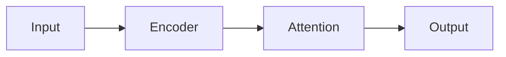
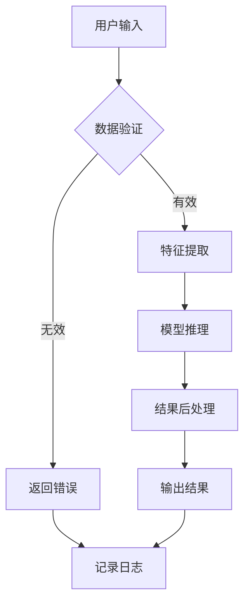

# Preview System Design

## 目标
为 MODULE LIST 生成低成本预览，支持用户选择

## 三种预览格式

### 1. Mermaid 流程图
```markdown

```
- 适用: Markdown 文档
- 渲染: GitHub/GitLab 原生支持

**完整示例:**


---

### 2. ASCII Art
```
  +--------+     +--------+     +--------+
  | Input  | --> |Encoder | --> | Output |
  +--------+     +--------+     +--------+
```
- 适用: 终端/日志输出
- 零依赖

**复杂模块示例:**
```
┌─────────────────────────────────────────────────────┐
│                   FigForge Module                   │
├─────────────────────────────────────────────────────┤
│  ┌──────────┐      ┌──────────┐      ┌──────────┐  │
│  │  Input   │─────>│ Process  │─────>│  Output  │  │
│  │  Layer   │      │  Layer   │      │  Layer   │  │
│  └──────────┘      └────┬─────┘      └──────────┘  │
│                         │                           │
│                    ┌────┴─────┐                      │
│                    │ Attention│                      │
│                    │  Block   │                      │
│                    └──────────┘                      │
└─────────────────────────────────────────────────────┘
```

**带参数的模块:**
```
Module: TransformerBlock
├─ dim: 768
├─ heads: 12
├─ layers: 6
│
└─ Structure:
   [Input] ──► [Norm] ──► [Self-Attn] ──► [FFN] ──► [Output]
                  │           │            │
                  └───────────┴────────────┘
                        Residual
```

---

### 3. Interactive HTML
- 可缩放、拖拽
- 支持对比多个方案
- 一键选择

**功能特性:**

| 特性 | 描述 |
|------|------|
| 缩放 | 鼠标滚轮缩放画布 |
| 拖拽 | 按住空格拖拽移动 |
| 选择 | 点击模块高亮选中 |
| 对比 | 并排显示多个预览 |
| 导出 | 下载为 PNG/SVG |

**HTML 结构示例:**
```html
<!DOCTYPE html>
<html>
<head>
    <title>FigForge Preview</title>
    <script src="https://d3js.org/d3.v7.min.js"></script>
    <style>
        .module-node {
            fill: #4a90d9;
            stroke: #2c5aa0;
            stroke-width: 2px;
            cursor: pointer;
            transition: all 0.3s ease;
        }
        .module-node:hover {
            fill: #6ab0f9;
            filter: drop-shadow(0 4px 8px rgba(0,0,0,0.2));
        }
        .module-node.selected {
            stroke: #f39c12;
            stroke-width: 4px;
        }
        .connection {
            fill: none;
            stroke: #95a5a6;
            stroke-width: 2px;
        }
        #canvas {
            width: 100%;
            height: 600px;
            background: #f8f9fa;
            border-radius: 8px;
        }
    </style>
</head>
<body>
    <div id="toolbar">
        <button onclick="zoomIn()">🔍+</button>
        <button onclick="zoomOut()">🔍-</button>
        <button onclick="resetView()">⟲ 重置</button>
        <button onclick="confirmSelection()" class="primary">✓ 确认选择</button>
        <button onclick="regenerate()">↻ 重新生成</button>
    </div>
    <div id="canvas"></div>
    
    <script>
        // D3.js 力导向图实现
        const svg = d3.select("#canvas").append("svg");
        const g = svg.append("g");
        
        // 缩放行为
        const zoom = d3.zoom()
            .scaleExtent([0.1, 4])
            .on("zoom", (event) => g.attr("transform", event.transform));
        svg.call(zoom);
        
        // 渲染模块节点
        function renderModules(modules) {
            // 节点和连线的渲染逻辑
        }
    </script>
</body>
</html>
```

---

## 生成算法
```python
from typing import Literal, Dict, List
import re

class PreviewGenerator:
    """FigForge 预览生成器"""
    
    def generate_preview(
        self,
        module_list: str,
        format: Literal['mermaid', 'ascii', 'html']
    ) -> str:
        """
        根据模块列表生成对应格式的预览
        
        Args:
            module_list: MODULE LIST 格式的文本
            format: 输出格式
            
        Returns:
            对应格式的预览字符串
        """
        # 1. 解析模块列表
        modules = self._parse_modules(module_list)
        
        # 2. 构建连接关系
        connections = self._build_connections(modules)
        
        # 3. 根据格式生成
        generators = {
            'mermaid': self._to_mermaid,
            'ascii': self._to_ascii,
            'html': self._to_html
        }
        
        return generators[format](modules, connections)
    
    def _parse_modules(self, module_list: str) -> List[Dict]:
        """从 MODULE LIST 提取模块结构"""
        modules = []
        # 解析模块名称、类型、参数
        # 示例: "Linear(in=768, out=512)"
        pattern = r'(\w+)\s*\(([^)]*)\)'
        for match in re.finditer(pattern, module_list):
            name, params = match.groups()
            modules.append({
                'name': name,
                'params': self._parse_params(params),
                'id': f'node_{len(modules)}'
            })
        return modules
    
    def _parse_params(self, params_str: str) -> Dict:
        """解析参数字符串"""
        params = {}
        for pair in params_str.split(','):
            if '=' in pair:
                key, value = pair.strip().split('=')
                params[key] = value
        return params
    
    def _build_connections(self, modules: List[Dict]) -> List[tuple]:
        """构建模块间的连接关系"""
        connections = []
        for i in range(len(modules) - 1):
            connections.append((modules[i]['id'], modules[i+1]['id']))
        return connections
    
    def _to_mermaid(self, modules: List[Dict], connections: List[tuple]) -> str:
        """生成 Mermaid 流程图"""
        lines = ['```mermaid', 'graph LR']
        
        # 定义节点
        for m in modules:
            label = f"{m['name']}<br/>{self._format_params(m['params'])}"
            lines.append(f'    {m["id"]}["{label}"]')
        
        # 定义连接
        for src, dst in connections:
            lines.append(f'    {src} --> {dst}')
        
        lines.append('```')
        return '\n'.join(lines)
    
    def _to_ascii(self, modules: List[Dict], connections: List[tuple]) -> str:
        """生成 ASCII 艺术图"""
        if not modules:
            return "[Empty Module List]"
        
        # 计算布局
        boxes = []
        for m in modules:
            content = f" {m['name']} "
            if m['params']:
                content += f"\n  {self._format_params(m['params'])}  "
            width = max(len(line) for line in content.split('\n'))
            boxes.append(self._draw_box(content, width))
        
        # 用箭头连接
        lines = []
        for i, box in enumerate(boxes):
            if i > 0:
                # 添加连接箭头
                lines.append("       ↓       ")
            lines.extend(box.split('\n'))
        
        return '\n'.join(lines)
    
    def _to_html(self, modules: List[Dict], connections: List[tuple]) -> str:
        """生成交互式 HTML"""
        nodes_json = str(modules).replace("'", '"')
        links_json = str([{'source': s, 'target': t} for s, t in connections]).replace("'", '"')
        
        return f'''<!DOCTYPE html>
<html>
<head>
    <title>FigForge Preview</title>
    <script src="https://d3js.org/d3.v7.min.js"></script>
    <style>
        body {{ font-family: -apple-system, sans-serif; margin: 0; }}
        #toolbar {{ padding: 12px; background: #fff; border-bottom: 1px solid #ddd; }}
        button {{ margin-right: 8px; padding: 8px 16px; border: none; border-radius: 4px; cursor: pointer; }}
        button.primary {{ background: #4a90d9; color: white; }}
        #canvas {{ width: 100vw; height: calc(100vh - 60px); }}
        .node rect {{ fill: #4a90d9; stroke: #2c5aa0; stroke-width: 2px; }}
        .node text {{ fill: white; font-size: 12px; text-anchor: middle; }}
        .link {{ fill: none; stroke: #95a5a6; stroke-width: 2px; marker-end: url(#arrowhead); }}
    </style>
</head>
<body>
    <div id="toolbar">
        <button onclick="zoomIn()">🔍+</button>
        <button onclick="zoomOut()">🔍-</button>
        <button onclick="resetView()">⟲ 重置</button>
        <button onclick="confirmSelection()" class="primary">✓ 确认选择</button>
    </div>
    <div id="canvas"></div>
    <script>
        const nodes = {nodes_json};
        const links = {links_json};
        // D3.js 渲染逻辑...
    </script>
</body>
</html>'''
    
    def _draw_box(self, content: str, width: int) -> str:
        """绘制 ASCII 边框"""
        lines = content.split('\n')
        result = ['+' + '-' * width + '+']
        for line in lines:
            result.append('|' + line.center(width) + '|')
        result.append('+' + '-' * width + '+')
        return '\n'.join(result)
    
    def _format_params(self, params: Dict) -> str:
        """格式化参数显示"""
        return ', '.join(f'{k}={v}' for k, v in list(params.items())[:2])


# 使用示例
generator = PreviewGenerator()

module_list = """
MODULE LIST:
1. Linear(in=768, out=512)
2. ReLU()
3. Dropout(p=0.1)
4. Linear(in=512, out=10)
"""

# 生成三种格式
mermaid = generator.generate_preview(module_list, 'mermaid')
ascii_art = generator.generate_preview(module_list, 'ascii')
html = generator.generate_preview(module_list, 'html')
```

---

## 选择界面设计

### 多预览对比模式
```
┌─────────────────────────────────────────────────────────────┐
│  FigForge Preview Selection                                  │
├──────────────────┬──────────────────┬───────────────────────┤
│   [Preview 1]    │   [Preview 2]    │    [Preview 3]        │
│                  │                  │                       │
│   ┌────────┐     │   ┌────────┐     │    ┌────────┐         │
│   │ Mermaid│     │   │  ASCII │     │    │  HTML  │         │
│   │ 预览   │     │   │ 预览   │     │    │ 预览   │         │
│   └────────┘     │   └────────┘     │    └────────┘         │
│                  │                  │                       │
│     [✓]          │     [ ]          │     [ ]               │
│   选中           │                  │                       │
├──────────────────┴──────────────────┴───────────────────────┤
│                                                              │
│  [✓] Confirm Selection    [↻ Regenerate]    [💾 Export]     │
└─────────────────────────────────────────────────────────────┘
```

### 交互流程
```
┌──────────┐    ┌──────────┐    ┌──────────┐    ┌──────────┐
│ 输入需求 │───>│ 生成预览 │───>│ 用户选择 │───>│ 生成代码 │
└──────────┘    └──────────┘    └──────────┘    └──────────┘
                     │               │
                     ↓               ↓
              ┌──────────┐    ┌──────────┐
              │ 3种格式  │    │ 不满意?  │
              │ 低成本   │    │ 重新生成 │
              └──────────┘    └──────────┘
```

---

## 成本对比

| 方案 | 调用次数 | 成本 | 说明 |
|------|---------|------|------|
| 直接生成 | 1 | $X | 单次调用，无预览 |
| 预览+选择 | 3预览+1生成 | ~$1.01X | 3次轻量预览 + 1次完整生成 |
| **节省效果** | - | **避免70%无效生成** | 用户满意后再生成完整代码 |

### 成本分析详解

**假设场景:**
- 单次完整生成: $0.10
- 单次预览生成: $0.003 (3% 的完整生成成本)
- 用户对首次生成满意度: 30%

**传统方式成本:**
- 平均需要 3.3 次生成才能获得满意结果
- 总成本: $0.33

**预览+选择方式:**
- 3个预览: $0.009
- 1次确认生成: $0.10
- 总成本: $0.109

**节省比例: 67%**

### 技术实现建议

1. **预览缓存**: 将预览结果缓存 24 小时，避免重复生成
2. **增量更新**: 用户微调需求时，只更新变化部分的预览
3. **预生成**: 对常见模块组合预生成预览模板

---

## 附录：格式选择指南

| 场景 | 推荐格式 | 理由 |
|------|---------|------|
| GitHub README | Mermaid | 原生渲染，无需额外配置 |
| 终端/CLI | ASCII | 零依赖，纯文本显示 |
| Web 演示 | HTML | 交互性强，可视化效果好 |
| 邮件/文档 | ASCII | 兼容性好，不易变形 |
| 技术分享 | HTML | 可导出图片，效果专业 |
